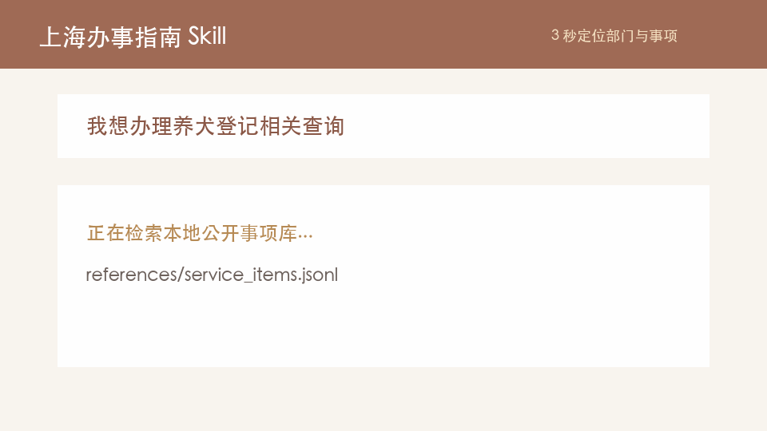

# 上海办事指南 Codex Skill

> 把“我该找哪个部门？”变成一条可执行的上海办事路径。


## 🎯 About

上海政务服务入口多、事项名长、个人/法人口径又容易混在一起；用户常常只知道“我要办一件事”，却不知道该找哪个部门。这个 Codex Skill 基于上海“一网通办”公开事项数据，帮助 Codex 从自然语言描述中匹配市级部门、候选事项、线上办理标记和官方办事指南链接。

首版内置 59 个市级部门、3784 条清洗事项记录，并额外包含一组“必须覆盖”的用户指定事项名称。它不会替代官方政策解释，而是让用户更快知道下一步该去哪查、找谁办、哪里需要复核。

## 👁️ Demo



示例输入：

```text
Use $shanghai-service-guide 我在上海想办理养犬登记相关查询，应该找哪个部门？
```

示例输出会推荐市公安局相关事项，列出“养犬登记证查询服务”的子事项，并说明公开数据是否标记为可网上办理。

## 🚀 Quick Start

复制 Skill 到 Codex skills 目录：

```bash
git clone <your-repo-url> shanghai-service-guide-skill
cd shanghai-service-guide-skill
cp -R shanghai-service-guide "${CODEX_HOME:-$HOME/.codex}/skills/"
```

立即使用：

```text
Use $shanghai-service-guide 我在上海要开公司、查合同示范文本，应该办哪个事项？
```

验证数据文件：

```bash
python3 shanghai-service-guide/scripts/validate_data.py \
  --items shanghai-service-guide/references/service_items.jsonl \
  --departments shanghai-service-guide/references/departments.json
```

## 🛠️ Usage

### 1. 询问办事路径

```text
Use $shanghai-service-guide 我要办理公积金提取，线上能办吗？
```

Skill 会优先判断用户身份是 `个人`、`法人` 还是不明确，然后在本地事项库中检索候选结果。回答应包含部门、事项/子事项、事项类型、线上办理标记、官方链接和下一步建议。

### 2. 查指定部门或事项

```text
Use $shanghai-service-guide 帮我看“市医保局”有哪些医保金相关服务。
```

可检索字段包括：

- `department_name` / `department_short_name`
- `role`
- `item_name`
- `subitem_name`
- `item_type`
- `st_net`
- `guide_url`

### 3. 使用必含事项清单

用户指定必须包含的事项位于：

- `shanghai-service-guide/references/required_items.json`
- `shanghai-service-guide/references/required-items.md`

其中 `official_status=matched` 表示已在当前公开事项库命中；`official_status=needs_verification` 表示已纳入覆盖，但当前公开市级事项快照未找到可靠匹配，回答时应提示用户到“一网通办”“随申办”或 021-12345 复核。

### 4. 刷新公开数据

全量刷新：

```bash
python3 shanghai-service-guide/scripts/fetch_zwdt.py \
  --output shanghai-service-guide/references/raw_items.json

python3 shanghai-service-guide/scripts/normalize_data.py \
  --input shanghai-service-guide/references/raw_items.json \
  --output shanghai-service-guide/references/service_items.jsonl

python3 shanghai-service-guide/scripts/build_reference.py \
  --input shanghai-service-guide/references/service_items.jsonl \
  --output-dir shanghai-service-guide/references

python3 shanghai-service-guide/scripts/validate_data.py \
  --items shanghai-service-guide/references/service_items.jsonl \
  --departments shanghai-service-guide/references/departments.json
```

抽样刷新两个重点部门：

```bash
python3 shanghai-service-guide/scripts/fetch_zwdt.py \
  --sample \
  --page-limit 1 \
  --output /tmp/zwdt_sample.json
```

常见参数：

| 参数 | 脚本 | 作用 |
| --- | --- | --- |
| `--sample` | `fetch_zwdt.py` | 只采集市公安局、市市场监管局样本 |
| `--page-limit N` | `fetch_zwdt.py` | 限制每个部门/身份采集页数 |
| `--sleep 0.5` | `fetch_zwdt.py` | 设置请求间隔，降低接口压力 |
| `--output-dir` | `build_reference.py` | 指定索引和部门文件输出目录 |
| `--sample-size` | `validate_data.py` | 校验后打印的随机样本数 |

## 📦 Repository Layout

```text
.
├── assets/
│   ├── logo.svg
│   └── demo.gif
├── shanghai-service-guide/
│   ├── SKILL.md
│   ├── agents/openai.yaml
│   ├── references/
│   │   ├── departments.json
│   │   ├── index.md
│   │   ├── required_items.json
│   │   ├── required-items.md
│   │   └── service_items.jsonl
│   └── scripts/
│       ├── fetch_zwdt.py
│       ├── normalize_data.py
│       ├── build_reference.py
│       └── validate_data.py
├── LICENSE
└── README.md
```

## 🤝 Contributing

欢迎提交 Issue 和 Pull Request，尤其是：

- 补充事项同义词、常见问法和部门别名
- 改进“一件事”类、随申办专区类事项的映射
- 增加详情页可访问时的材料、地点、流程提取
- 修复官方页面结构变化导致的采集问题

建议流程：

1. Fork 仓库并创建分支：`git checkout -b feat/your-change`
2. 修改数据、脚本或 Skill 指令
3. 运行 `validate_data.py` 和 Codex Skill 校验
4. 提交 PR，并说明数据来源、变更范围和验证结果

## ⚠️ Disclaimer

本项目只辅助定位公开政务服务信息，不替代官方办理结果、政策解释或法律意见。政务事项、办理条件、材料、窗口和线上入口可能随政策和系统调整而变化；正式办理前，请以“一网通办”、承办部门或上海政务服务总客服 021-12345 的最新答复为准。
